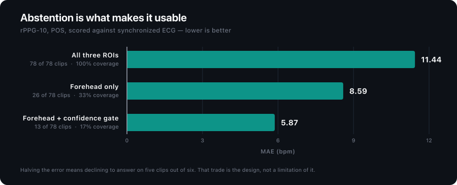
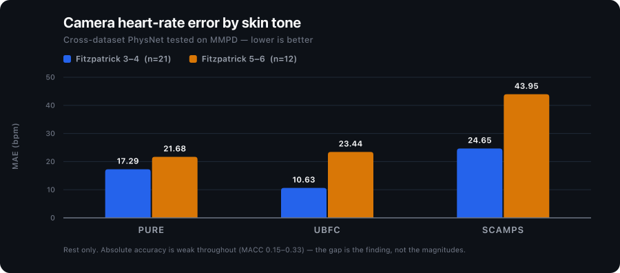

 

## What I'm building

**Quantara** — emotional intelligence infrastructure. Biometric signals in, a read on how
you actually feel out.

- Cross-modal fusion running live in production — **cardiac, camera-derived HR, ambient
  context and music signal**, blended against a per-user arousal baseline.
- A six-phase Neural Workflow engine — ingest → detect → predict → feedback → report →
  evolve — with the prediction layer wired to real outcome feedback rather than to its
  own guesses.
- Per-user baseline modulation, so the read is calibrated to *you* rather than to a
  population mean. Ships on iOS, watchOS and the web.
- Designed to **abstain under low confidence**. A confident wrong number is worse than no
  number, and on this kind of signal the wrong number is easy to produce.

**belcrm** — an enterprise CRM for magazine distribution: ticketing, case management,
routing, SLA tracking, and an AI layer over customer service and distribution operations.
Node/Express + SQLite, deployed on Railway.

**rPPG research** — camera-based heart-rate extraction, and the question of when it can be
trusted. Two repos below. Short version: less often than the field's headline numbers
suggest, and considerably less often on darker skin.

## Public work

  
  

**[rppg10-extractor](https://github.com/QEbellavita/rppg10-extractor)** — camera-based HR
extraction over Dataset_rPPG-10, scored against synchronized 1000 Hz ECG. The validation
doc opens by correcting an earlier claim the project itself got wrong.

**[rppg-skin-tone-equity](https://github.com/QEbellavita/rppg-skin-tone-equity)** —
Fitzpatrick-stratified error for cross-dataset deep rPPG. Dark skin is worse on every
metric from every source model. Measured on a weak baseline at rest with n=12 — stated up
front, because the caveats are the finding as much as the numbers are.

Most of my work is in private repos — Quantara, belcrm, and client systems. What's public
is the research I can share without redistributing gated corpora or anyone's data.

## Stack

  
<strong>Languages &amp; ML</strong>

  

  
<strong>Backend &amp; Data</strong>

  

  
<strong>Mobile &amp; Frontend</strong>

  

  
<strong>Infra</strong>

  

<!--
  TODO before this reads as finished:
  - Add real contact/site badges here once you decide what to publish. The previous
    draft linked quantara.app / a mailto on the GitHub noreply address; neither was
    a real destination, so both were removed rather than left as dead links.
  - The snake image above is generated by .github/workflows/snake.yml into the
    `output` branch. It renders as broken until that workflow runs once.
-->
